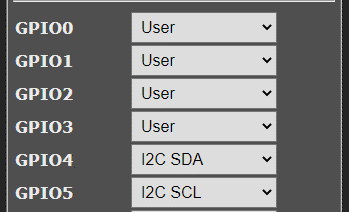
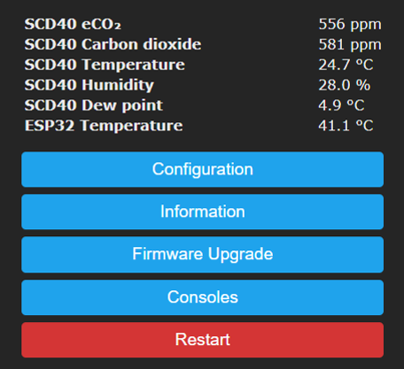

# SmartHome_Sensors
Verschiedene Sensoren mit Tasmota

# Sensoren die Unterstütz werden
| Name    | Beschreibung        | Getestet| LINK                                                                      |
|---------|---------------------|---------|---------------------------------------------------------------------------|
| SCD40   | CO2 sensor          |    X    | [https://sensirion.com](https://sensirion.com/de/produkte/katalog/SCD40/) |
| TSL2591 | Lichtsensor         |    X    | [ams-osram.com](https://ams-osram.com/products/sensors/ambient-light-color-spectral-sensors/ams-tsl25911-ambient-light-sensor) |
| BME280  | Environment Sensor  |    X    | [bosch-sensortec.com](https://www.bosch-sensortec.com) |
| BME680  | CO2                 |    X    | [bosch-sensortec.com](https://www.bosch-sensortec.com) |
| HDC1080 | T/RH                |    X    | [ti.com](https://www.ti.com/product/HDC1080) |

# Tasmota precompiled

[SmartHome_Sensors/firmware/](SmartHome_Sensors/firmware/): tasmota-sensors.bin

settings in Tasmota (ESP8266)

# Verdrahtung

## Pinout of ESP 8266 and WEMOS-D1

| Label | IO    | Beschreibung      |
|-------|-------|-------------------|
| D1	  | GPIO5 | used as SCL (I2C) |
| D2	  | GPIO4 | used as SDA (I2C) |

https://randomnerdtutorials.com/esp8266-pinout-reference-gpios/

## Pinout ESP32

GPIO 21 (SDA)
GPIO 22 (SCL)

https://randomnerdtutorials.com/esp32-pinout-reference-gpios/

# Tasmota: Main Menu

